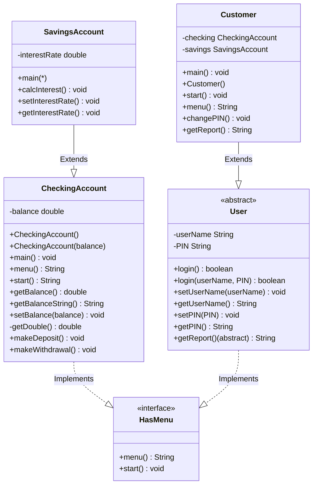

# projectNine
Bank System Project

```mermaid
classDiagram
    class HasMenu {
        <<interface>>
        +menu() String
        +start() void
    }

    class CheckingAccount {
        -balance double
        +CheckingAccount()
        +CheckingAccount(balance)
        +main() void
        +menu() String
        +start() String
        +getBalance() double
        +getBalanceString() String
        +setBalance(balance) void
        -getDouble() double
        +makeDeposit() void
        +makeWithdrawal() void
    }

    class SavingsAccount {
        -interestRate double
        +main(*)
        +calcInterest() void
        +setInterestRate() void
        +getInterestRate() void
    }

    class User {
        <<abstract>>
        -userName String
        -PIN String
        +login() boolean
        +login(userName, PIN) boolean
        +setUserName(userName) void
        +getUserName() String
        +setPIN(PIN) void
        +getPIN() String
        +getReport() (abstract) String
    }

    class Customer {
        -checking CheckingAccount
        -savings SavingsAccount
        +main() void
        +Customer()
        +start() void
        +menu() String
        +changePIN() void
        +getReport() String
    }

    SavingsAccount --|> CheckingAccount : Extends
    CheckingAccount ..|> HasMenu : Implements
    User ..|> HasMenu : Implements
    Customer --|> User : Extends
```
